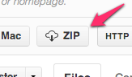

!SLIDE

# Intro to Backbone.js

Aidan Feldman

[github.com/afeld/intro\_to\_backbone](https://github.com/afeld/intro_to_backbone)

!SLIDE

# moi

* Senõr Web Developer, [Jux](https://jux.com)
* Instructor, [General Assembly](https://generalassemb.ly/) and [NYU](http://scps.nyu.edu/)
* Author, *[Developing a Backbone.js Edge](http://bleedingedgepress.com/our-books/)* (more on that later)

!SLIDE

# Why Backbone vs. jQuery only?

!SLIDE incremental

# Why Backbone vs. jQuery only?

## Code organization

* Useful abstractions
    * Models
    * Perisistence over REST
* Encourage modularity
    * Views

!SLIDE

# Play time!

## Docs:

* [underscorejs.org](http://underscorejs.org/)
* [backbonejs.org](http://backbonejs.org/)

!SLIDE incremental

# Why Backbone vs. X?

([TodoMVC](http://addyosmani.github.com/todomvc/) options)

* Easy to get set up
* Easy to use pieces (both ways)
* [Easy to understand](http://backbonejs.org/docs/backbone.html)

!SLIDE incremental

# Also

!SLIDE

## Y'all get a free copy of *Developing a Backbone.js Edge*

!SLIDE

# Fin.

Aidan Feldman

[@aidanfeldman](https://twitter.com/aidanfeldman)

[api.afeld.me](http://api.afeld.me)
